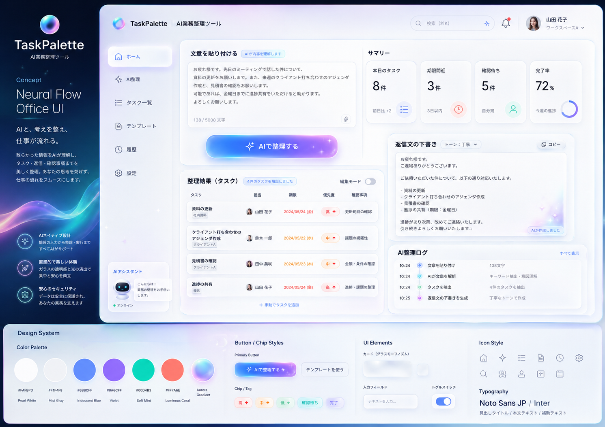

# TaskPalette｜AI業務整理ツール

メール・チャット・会議メモを貼り付けると、AIがタスク・担当者・期限・優先度・確認事項へ整理し、返信文まで生成する業務支援Webアプリです。



## 技術構成

- React / Vite / TypeScript
- Cloudflare Workers Static Assets
- Cloudflare Workers AI
- Cloudflare D1
- CSS Glassmorphism / Aurora UI

## 実装済み

- Workers AIによる業務文章の解析
- Workers AIが使えない場合の簡易解析フォールバック
- 原文・返信文・タスク・操作ログのD1保存
- ホームダッシュボード
- AI整理専用画面
- タスク全文検索、候補表示、状態・優先度フィルター、並べ替え
- タスク追加、編集、状態変更、削除
- テンプレートの作成、編集、お気に入り、削除、再利用
- AI解析履歴と操作ログ
- ユーザー・ワークスペース・AI初期設定のD1保存
- レスポンシブ表示

## マイグレーション

新規環境では、次の2つが順番に適用されます。

- `0001_init.sql`：analyses / tasks / activity_logs
- `0002_navigation_features.sql`：templates / app_settings / 検索用インデックス

```powershell
npm run db:migrate:local
```

本番D1：

```powershell
npm run db:migrate:remote
```

## ローカル起動

```powershell
npm run cf:dev
```

## デプロイ

```powershell
npm run db:migrate:remote
npm run deploy
```

## 主なAPI

| Method | Path | 内容 |
|---|---|---|
| GET | `/api/dashboard` | 集計・最新タスク・ログ・返信文 |
| POST | `/api/analyze` | AI解析とD1保存 |
| GET | `/api/tasks?q=...` | タスク検索・絞り込み・並べ替え |
| POST | `/api/tasks` | タスク追加 |
| PATCH | `/api/tasks/:id` | タスク編集・状態更新 |
| DELETE | `/api/tasks/:id` | タスク削除 |
| GET/POST | `/api/templates` | テンプレート一覧・作成 |
| PATCH/DELETE | `/api/templates/:id` | テンプレート更新・削除 |
| GET | `/api/history` | AI解析履歴・操作ログ |
| GET/PUT | `/api/settings` | ワークスペース設定 |

## データの流れ

```text
文章入力
  ↓ POST /api/analyze
Cloudflare Worker
  ↓ Workers AI / フォールバック解析
D1
  ├─ analyses
  ├─ tasks
  ├─ activity_logs
  ├─ templates
  └─ app_settings
  ↓
React UI
  ├─ ダッシュボード
  ├─ 全文検索
  ├─ テンプレート
  ├─ 履歴
  └─ 設定
```
